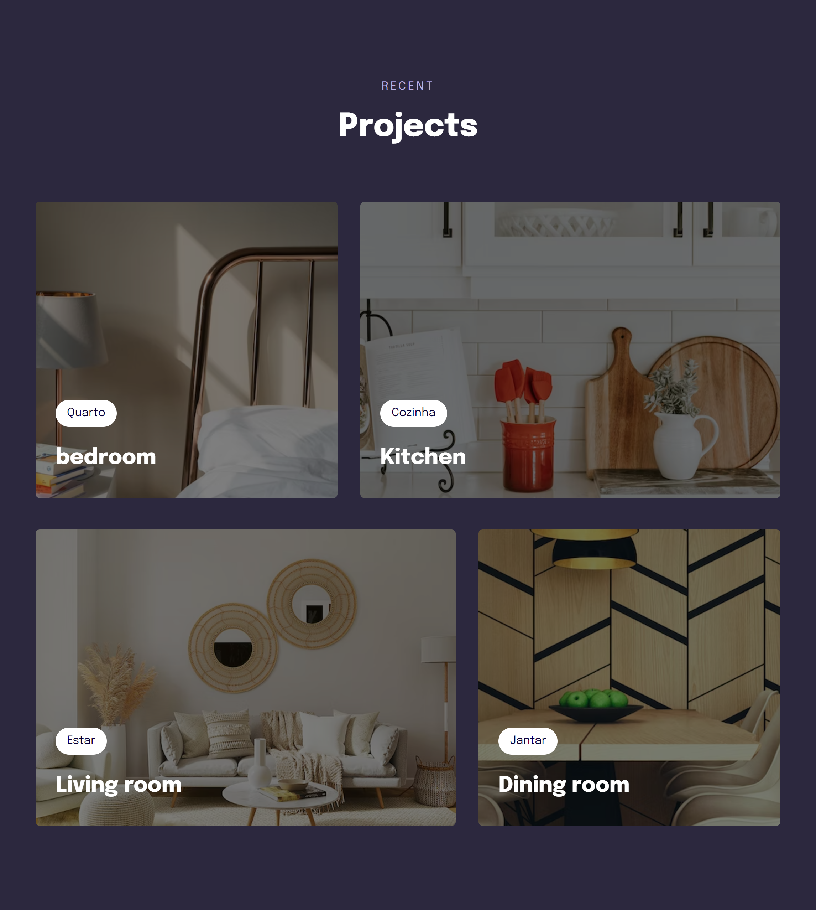

<h1 align="center">Responsive Website</h1>

## 📋 Descrição do projeto

O <strong>website</strong> foi construído primeiramente na versão <em>mobile</em> e depois adaptado para versão <em>desktop</em>. O objetivo do projeto é a assimilação e aplicação de propriedades <em><strong>CSS</strong><em> mais avançadas.

- O website foi desenvolvido durante o stage 03 da Trilha Explorer da <a href="https://www.rocketseat.com.br/">@Rocketseat</a>.

> HTML:
- Tags de texto;
- Tags semânticas;
- Tags de midias e seus atributos de acessibilidade.
 
> CSS:
- Pseudo-classes;
- Propriedades de posicionamento; 
- Modo de exibição dos elementos;
- Modelos de cursor;
- Variáveis;
- Estilização de bordas;
- Transformações de textos;
- Seletores e suas combinações;
- Propriedades de alinhamento e espaçamento dos elementos;
- Animações;
- Propriedades de responsividade;
- Função clamp();
- Filtros dos elementos;
- At-rules.

> Protótipo:

🔗 [Clique aqui para acessar](https://nathxrz.github.io/TrilhaExplorer-projeto-4/)
 

## 🛠️ Tecnologias
- HTML
- CSS

## 📩 Contato
> 📧 nathyrezendemachado@gmail.com  
> 💼 <a href="https://www.linkedin.com/in/nathalia-machado-021b1b230/"> LinkedIn</a>  

    